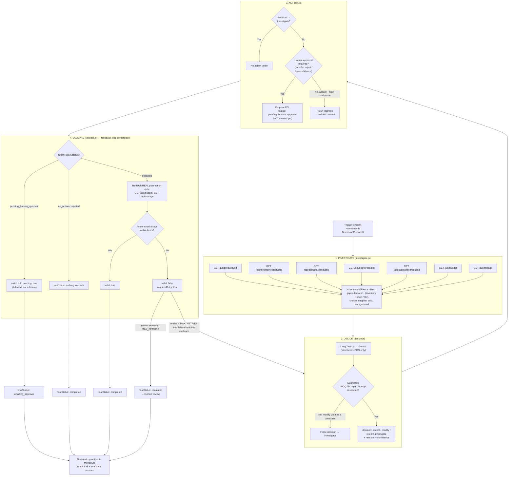
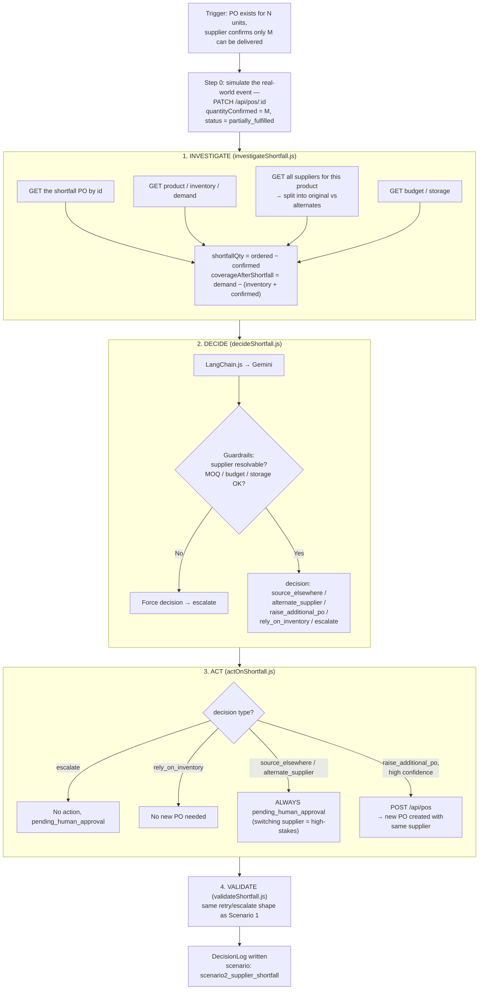

# Architecture

## Overview

The agent is a hand-written state machine — `investigate → decide → act → validate` —
not an autonomous LangChain agent-executor. Every transition is explicit and traceable,
by design (see `README.md` § Design Decisions for why).

The LLM (Gemini, via LangChain.js) is called **only** inside `decide`. It never fetches
its own facts — all evidence is gathered deterministically beforehand, and every LLM
output passes through deterministic guardrails before being trusted.

## Scenario 1 — Purchase Recommendation Review

## Scenario 2 — Supplier Cannot Fulfil the Purchase

Branches off the **same** `investigate → decide → act → validate` shape. Only the evidence
gathered, the decision options, and the action taken differ.

## Why this design

| Choice | Reason |
|---|---|
| Hand-written state machine, not LangChain agent-executor | Every transition is one we chose — fully explainable and debuggable live, per the brief's explainability requirement |
| LLM called only in `decide`, on pre-gathered evidence | Keeps the LLM's job narrow: reason over facts, don't fetch them — reduces hallucination surface area |
| Deterministic guardrails after every LLM call | The model's output is never trusted blindly — MOQ, budget, and storage are checked in code, not left to the LLM's arithmetic |
| Validation re-checks *actual* post-action state, not just the proposal | Catches drift between what was intended and what actually happened — this is the feedback loop the brief calls out by name |
| Retry with augmented evidence, capped, then escalate | Demonstrates a self-correcting loop without looping forever — `previousAttemptFailed` context lets the LLM reason about *why* the first attempt failed |
| Human approval gates `modify` / `reject` / low confidence / supplier switches | Directly answers the brief's "when human approval may be appropriate" |
| Scenario 2 reuses the identical 4-step shape | Proves the architecture generalizes — same reason Scenario 3/4 are documented as natural extensions rather than built |